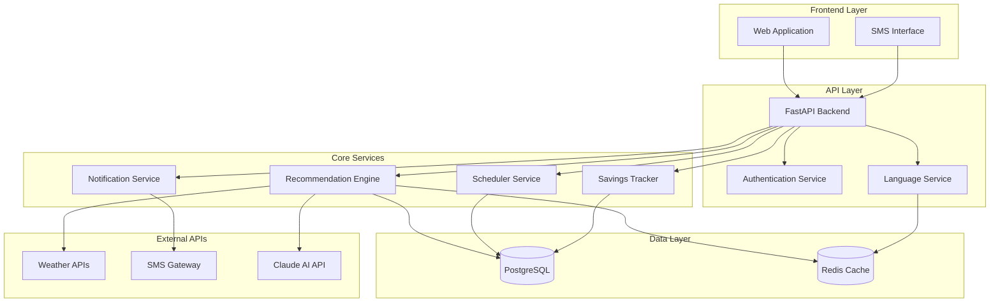

# Design Document: Jal Sathi

## Overview

Jal Sathi is a web-based AI irrigation advisor platform that provides personalized irrigation recommendations to Indian farmers in their regional languages. The system combines weather data, crop science, and machine learning to optimize irrigation schedules, targeting 30-40% water savings and significant cost reductions.

The platform follows a simple user journey: farmers complete a 5-question onboarding in their preferred language, receive daily irrigation recommendations, view a 7-day schedule, track their savings, and get SMS alerts for critical updates.

## Architecture

### System Architecture



### Technology Stack

- **Frontend**: React with responsive design, optimized for low-bandwidth connections
- **Backend**: Python FastAPI for high-performance API development
- **Database**: PostgreSQL for reliable data persistence
- **Cache**: Redis for weather data and recommendation caching
- **AI**: Claude API for intelligent recommendation generation
- **SMS**: Integration with Indian SMS gateway providers
- **Weather**: Multiple weather API sources with fallback mechanisms

## Components and Interfaces

### 1. Web Application Frontend

**Purpose**: Responsive web interface for farmer interactions

**Key Components**:
- **Language Selector**: Dropdown supporting 8 Indian languages
- **Onboarding Flow**: 5-step wizard for field setup
- **Dashboard**: Main view showing today's recommendation prominently
- **Schedule View**: 7-day calendar with visual irrigation indicators
- **Savings Tracker**: Progress bars and milestone celebrations
- **Settings**: Profile management and notification preferences

**Interface Requirements**:
- Mobile-first responsive design (320px to 1920px)
- High contrast colors for outdoor visibility
- Large touch targets (minimum 44px)
- Offline capability with service workers
- Progressive Web App (PWA) features

### 2. Recommendation Engine

**Purpose**: Core AI system generating personalized irrigation advice

**Input Parameters**:
- Weather forecast (7-day)
- Soil moisture estimates
- Crop type and growth stage
- Historical irrigation patterns
- Field characteristics (size, location, irrigation method)

**Algorithm Overview**:
1. **Evapotranspiration Calculation**: Uses Penman-Monteith equation with crop coefficients
2. **Soil Water Balance**: Tracks water input/output over time
3. **Weather Integration**: Incorporates rainfall probability and temperature
4. **AI Enhancement**: Claude API for contextual recommendations and explanations

**Output Format**:
```json
{
  "irrigate": true,
  "amount_mm": 25,
  "timing": "evening",
  "confidence": 0.85,
  "reasoning": "Low soil moisture, no rain expected for 3 days",
  "localized_message": "Kal shaam 25mm paani dein"
}
```

### 3. Language Service

**Purpose**: Multi-language support for all user-facing content

**Supported Languages**:
- Hindi (हिंदी)
- English
- Marathi (मराठी)
- Gujarati (ગુજરાતી)
- Punjabi (ਪੰਜਾਬੀ)
- Tamil (தமிழ்)
- Telugu (తెలుగు)
- Kannada (ಕನ್ನಡ)

**Translation Strategy**:
- Static content: Pre-translated JSON files
- Dynamic content: Template-based with variable substitution
- Agricultural terminology: Specialized dictionaries
- SMS messages: Optimized for 160-character limit

### 4. SMS Service

**Purpose**: Reliable delivery of irrigation alerts via text messages

**Features**:
- Daily recommendation delivery by 6 AM
- Urgent weather alerts
- Delivery confirmation and retry logic
- Regional language support
- Two-way communication for farmer feedback

**Message Templates**:
```
Hindi: "Aaj shaam 20mm paani dein. Barish ki sambhavna kam hai. -Jal Sathi"
English: "Water 20mm this evening. Low rain chance. -Jal Sathi"
```

### 5. Weather Integration Service

**Purpose**: Reliable weather data aggregation from multiple sources

**Data Sources**:
- Primary: Indian Meteorological Department (IMD) data
- Secondary: OpenWeatherMap API
- Tertiary: Local weather station networks

**Data Points**:
- Temperature (min/max)
- Humidity
- Rainfall (actual and forecast)
- Wind speed
- Solar radiation
- Evapotranspiration reference (ETo)

**Caching Strategy**:
- 6-hour refresh cycle
- Fallback to cached data during API failures
- Data quality scoring and source prioritization

## Data Models

### Farmer Profile
```python
class Farmer:
    id: UUID
    phone_number: str
    preferred_language: str
    created_at: datetime
    last_active: datetime
    sms_enabled: bool
```

### Field Information
```python
class Field:
    id: UUID
    farmer_id: UUID
    crop_type: str
    field_size_acres: float
    location_lat: float
    location_lng: float
    pincode: str
    irrigation_method: str  # drip, sprinkler, flood
    planting_date: date
    created_at: datetime
```

### Irrigation Recommendation
```python
class Recommendation:
    id: UUID
    field_id: UUID
    date: date
    irrigate: bool
    amount_mm: float
    timing: str  # morning, afternoon, evening
    confidence: float
    weather_data: dict
    reasoning: str
    localized_message: str
    created_at: datetime
```

### Irrigation Activity
```python
class IrrigationActivity:
    id: UUID
    field_id: UUID
    date: date
    amount_mm: float
    method: str
    farmer_reported: bool
    cost_rupees: float
    created_at: datetime
```

### Savings Calculation
```python
class SavingsRecord:
    id: UUID
    field_id: UUID
    period_start: date
    period_end: date
    water_saved_liters: float
    cost_saved_rupees: float
    traditional_usage_liters: float
    actual_usage_liters: float
    calculated_at: datetime
```

## Correctness Properties

*A property is a characteristic or behavior that should hold true across all valid executions of a system—essentially, a formal statement about what the system should do. Properties serve as the bridge between human-readable specifications and machine-verifiable correctness guarantees.*

### Property 1: Field Size Validation
*For any* field size input, the system should accept values between 0.1 and 50 acres and reject all other values
**Validates: Requirements 1.5**

### Property 2: Crop Options Localization  
*For any* selected language and crop type selection, all crop options should be displayed in the farmer's selected language
**Validates: Requirements 1.4**

### Property 3: Recommendation Content Completeness
*For any* irrigation recommendation, it should contain exactly three pieces of information: irrigation decision (yes/no), water amount in millimeters, and optimal timing
**Validates: Requirements 2.2, 3.2**

### Property 4: Language Consistency
*For any* farmer with a selected language preference, all system messages, recommendations, and interface text should be displayed in that same language
**Validates: Requirements 2.3, 2.4, 4.4, 8.4**

### Property 5: Recommendation Algorithm Inputs
*For any* recommendation generation, changing weather forecast, soil moisture, crop stage, or historical irrigation patterns should potentially affect the recommendation output
**Validates: Requirements 2.5**

### Property 6: Weather Change Responsiveness
*For any* significant weather condition change, the system should update recommendations and trigger farmer notifications
**Validates: Requirements 2.6**

### Property 7: Schedule Detail Information
*For any* day in the 7-day schedule that is selected, the detail view should include weather forecast information and reasoning for the irrigation decision
**Validates: Requirements 3.4**

### Property 8: Schedule Updates
*For any* change in weather or field conditions, the 7-day irrigation schedule should be updated to reflect the new conditions
**Validates: Requirements 3.5**

### Property 9: Schedule Change Highlighting
*For any* significant change to the irrigation schedule, the changes should be visually highlighted with explanatory reasoning
**Validates: Requirements 3.6**

### Property 10: Water Savings Calculation
*For any* field with irrigation history, water savings should be calculated by comparing recommended irrigation amounts with traditional over-watering patterns
**Validates: Requirements 4.1**

### Property 11: Cost Savings Calculation
*For any* water savings calculation, cost savings should be computed using local water rates between ₹2-5 per 1000 liters
**Validates: Requirements 4.2**

### Property 12: Savings Display Completeness
*For any* savings display, both water saved (in liters) and money saved (in rupees) should be shown
**Validates: Requirements 4.3**

### Property 13: Milestone Celebrations
*For any* savings milestone achievement, congratulatory messages should be displayed to the farmer
**Validates: Requirements 4.6**

### Property 14: SMS Message Formatting
*For any* SMS message sent to farmers, it should be in their preferred language, contain irrigation decision/amount/timing, and be within 160 characters
**Validates: Requirements 5.2, 5.4**

### Property 15: SMS Delivery Triggers
*For any* daily recommendation generation or urgent weather condition, an SMS message should be sent to the farmer's registered number
**Validates: Requirements 5.1, 5.3**

### Property 16: SMS Retry Logic
*For any* failed SMS delivery, the system should retry up to 3 times before marking as failed
**Validates: Requirements 5.6**

### Property 17: SMS Reply Processing
*For any* farmer reply to SMS messages, the feedback should be processed and stored in the system
**Validates: Requirements 5.5**

### Property 18: Weather Data Processing
*For any* weather data processing, the system should consider temperature, humidity, rainfall, wind speed, and forecast accuracy
**Validates: Requirements 6.2**

### Property 19: Weather API Fallback
*For any* weather API unavailability, the system should use cached data and notify users of potential inaccuracy
**Validates: Requirements 6.4**

### Property 20: Location-Based Weather Selection
*For any* farmer location, the system should prioritize weather stations within 50km of their field
**Validates: Requirements 6.5**

### Property 21: Extreme Weather Handling
*For any* extreme weather prediction, the system should issue special advisories and modify irrigation schedules accordingly
**Validates: Requirements 6.6**

### Property 22: Data Persistence
*For any* farmer profile, field data, or irrigation activity, the information should be immediately stored in the persistent database with timestamps
**Validates: Requirements 7.1, 7.2**

### Property 23: Cross-Interface Data Sync
*For any* data update through the web interface, the same data should be accessible and consistent through the SMS interface
**Validates: Requirements 7.3**

### Property 24: Offline Data Caching
*For any* poor network connectivity situation, the system should cache data locally and sync when connection is restored
**Validates: Requirements 7.4**

### Property 25: Data Freshness Indication
*For any* cached recommendation displayed during intermittent connectivity, the system should indicate the data freshness to the user
**Validates: Requirements 8.6**

## Error Handling

### Weather API Failures
- **Primary Strategy**: Graceful degradation using cached weather data
- **Fallback Chain**: IMD → OpenWeatherMap → Cached data → Default conservative recommendations
- **User Communication**: Clear messaging about data staleness and recommendation confidence
- **Recovery**: Automatic retry with exponential backoff

### SMS Delivery Failures
- **Retry Logic**: Up to 3 attempts with increasing delays (1min, 5min, 15min)
- **Alternative Channels**: Web app notifications as backup
- **Logging**: Comprehensive delivery status tracking
- **User Feedback**: Delivery confirmation when possible

### Database Connection Issues
- **Connection Pooling**: Automatic connection recovery
- **Transaction Safety**: Rollback on partial failures
- **Data Integrity**: Constraint validation and foreign key checks
- **Backup Strategy**: Daily automated backups with point-in-time recovery

### Language Service Errors
- **Fallback Language**: Default to English if preferred language fails
- **Missing Translations**: Graceful handling with placeholder text
- **Character Encoding**: UTF-8 support for all Indian languages
- **Template Errors**: Safe rendering with error boundaries

### Recommendation Engine Failures
- **Input Validation**: Comprehensive validation of all input parameters
- **AI API Failures**: Fallback to rule-based recommendations
- **Confidence Scoring**: Lower confidence for degraded mode recommendations
- **Manual Override**: Admin capability to provide emergency recommendations

## Testing Strategy

### Dual Testing Approach

The testing strategy employs both unit testing and property-based testing as complementary approaches:

**Unit Tests**: Focus on specific examples, edge cases, and integration points
- Language switching functionality
- SMS message formatting edge cases  
- Weather API integration points
- Database connection handling
- Error boundary conditions

**Property-Based Tests**: Verify universal properties across all inputs using randomized testing
- Field size validation across random inputs
- Recommendation content completeness for all scenarios
- Language consistency across all system components
- Savings calculations with various input combinations
- SMS formatting constraints with random message content

### Property-Based Testing Configuration

- **Testing Library**: Hypothesis for Python (backend) and fast-check for JavaScript (frontend)
- **Test Iterations**: Minimum 100 iterations per property test
- **Test Tagging**: Each property test tagged with format: **Feature: jal-sathi, Property {number}: {property_text}**
- **Coverage**: Each correctness property implemented by exactly one property-based test
- **Integration**: Property tests run as part of CI/CD pipeline

### Test Environment Setup

- **Test Database**: Isolated PostgreSQL instance with test data
- **Mock Services**: Weather API mocks with configurable responses
- **SMS Testing**: Mock SMS gateway for delivery testing
- **Language Testing**: Comprehensive test data for all 8 supported languages
- **Performance Testing**: Load testing for rural bandwidth conditions

### Acceptance Testing

- **User Journey Tests**: Complete farmer workflows from onboarding to savings tracking
- **Cross-Browser Testing**: Chrome, Firefox, Safari on mobile and desktop
- **Accessibility Testing**: Screen reader compatibility and keyboard navigation
- **Localization Testing**: Native speaker validation for all supported languages
- **Performance Testing**: Sub-3-second load times on 2G connections