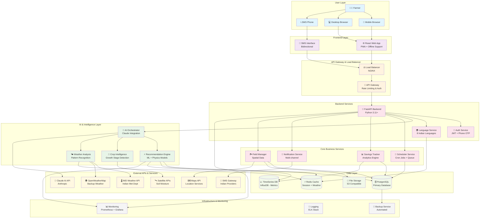
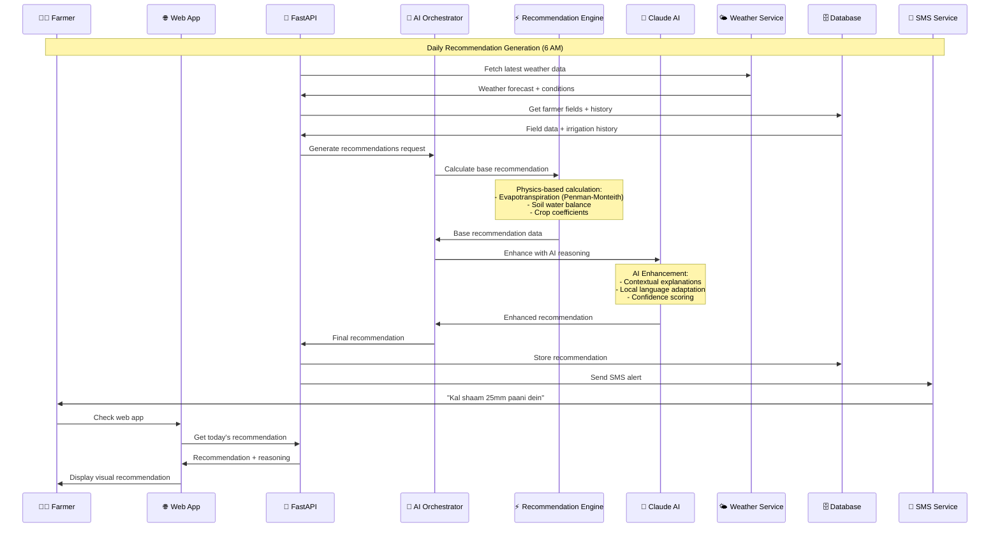
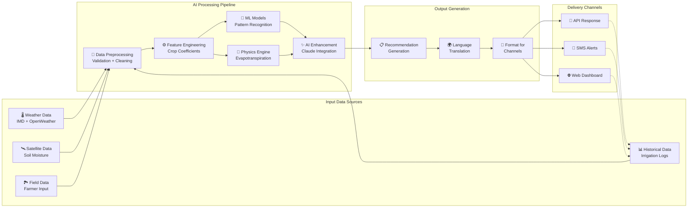
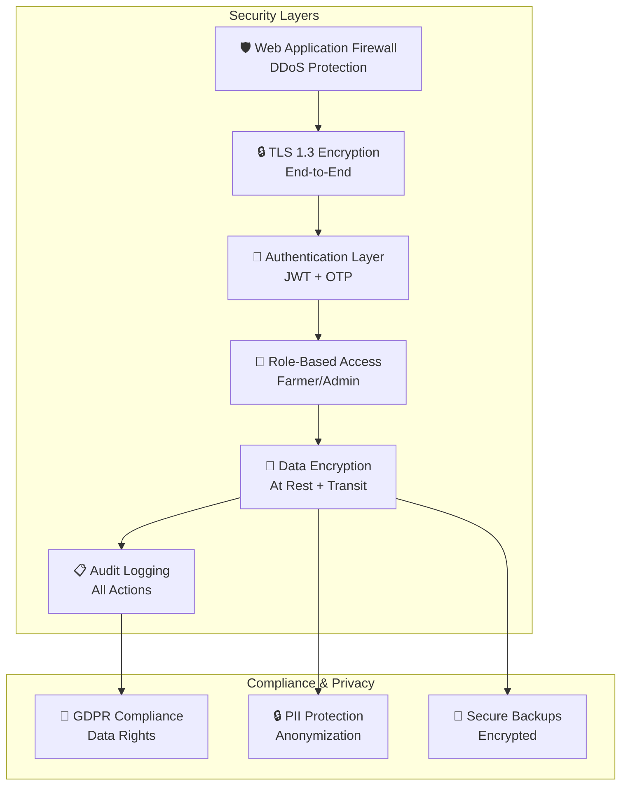
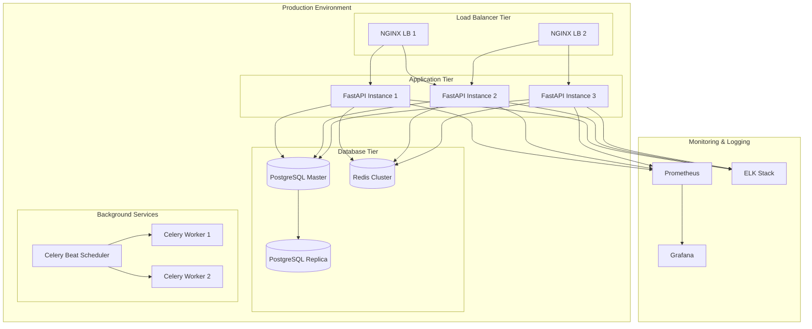

# Jal Sathi - Comprehensive Architecture Diagram

## High-Level System Architecture

## AI-Powered Recommendation Flow

## Data Flow Architecture

## Technology Stack Details

### Frontend Technologies
- **React 18+** with TypeScript
- **Tailwind CSS** for responsive design
- **PWA** with service workers for offline support
- **React Query** for data fetching and caching
- **i18next** for internationalization

### Backend Technologies
- **Python 3.11+** with FastAPI
- **Pydantic** for data validation
- **SQLAlchemy** with async support
- **Alembic** for database migrations
- **Celery** for background tasks
- **Redis** for caching and task queue

### AI & ML Stack
- **Claude API** (Anthropic) for intelligent reasoning
- **NumPy/SciPy** for scientific calculations
- **Pandas** for data manipulation
- **Scikit-learn** for ML models
- **Custom physics models** for evapotranspiration

### Infrastructure
- **PostgreSQL 15+** for primary database
- **Redis 7+** for caching and sessions
- **InfluxDB** for time-series metrics
- **NGINX** for load balancing
- **Docker** for containerization
- **Kubernetes** for orchestration

## Security Architecture

## Deployment Architecture

## Key Architectural Decisions

### 1. AI-First Approach
- **Claude API Integration**: Provides contextual reasoning and natural language explanations
- **Hybrid Model**: Combines physics-based calculations with AI enhancement
- **Confidence Scoring**: AI provides confidence levels for recommendations

### 2. Multi-Language Support
- **Template-based Translation**: Efficient localization for 8 Indian languages
- **AI-Powered Adaptation**: Claude helps adapt agricultural terminology
- **SMS Optimization**: Language-specific character limits and formatting

### 3. Offline-First Design
- **Progressive Web App**: Works offline with cached recommendations
- **Data Synchronization**: Automatic sync when connectivity returns
- **SMS Fallback**: Critical alerts via SMS when internet is unavailable

### 4. Scalable Architecture
- **Microservices**: Loosely coupled services for independent scaling
- **Caching Strategy**: Multi-layer caching for performance
- **Background Processing**: Async tasks for recommendation generation

### 5. Rural-Optimized
- **Low Bandwidth**: Optimized for 2G/3G connections
- **Progressive Loading**: Critical content loads first
- **Compression**: Efficient data transfer protocols